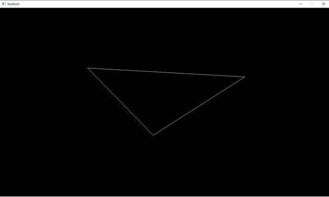

# Flocon de Koch

## Création d'un exécutable qui dessine un flocon de Koch à partir d'un triangle générer à la main par l'utilisateur.

### Contexte :
En 1904, le mathématicien suédois Helge von Koch décrit l'une des premières structures fractales à partir d'un segment de droite : [la courbe de Koch](images/courbe.png).

Le flocon de Koch suit la même logique que la courbe de Koch mais à partir de trois segments qui forment un trianlge.

### I - Génération du triangle
    Sur une fenêtre vide, l'utilisateur pointe trois points de son choix (clique gauche) pour générer le triangle reliant ces trois points.
### II - Dessin du flocon de Koch
    A l'aide des flèches directionnelles du clavier <- et ->, l'utilisateur peut observer les itérations précédentes* (<-) et les itérations suivantes* (->).

    * : Le triangle de départ étant l'itération 0

### Notes : 
---